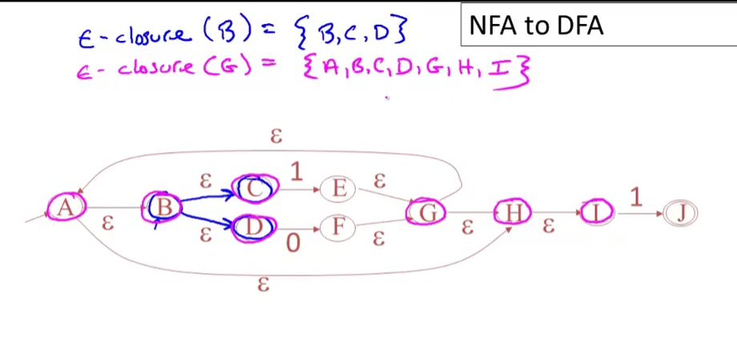

# Finite Automata

Finite automata = can be implementation of regex

They both can specify the regular languages. Simply think about it as a character by character analysis of a string. This can also be thought of/implemented as a set of nested switch statements and state variables. Implementation can be boiled down to a lookup table.

|Finite automata has..|Symbol|
|--|--|
|An input alphabet|∑|
|A set of states|S|
|A start state|n|
|A set of accepting states|F⊆S|
|A set of transitions from state to state|state →input state

**Transitions**
* Defined as: S1 →a S2
* Read as: In state S1 on input a go to state S2

**Accept/Reject**
* If we at the **end of input** and in **accepting state** => accept
* Otherwise => reject -- this means if there is no transition for the input, it fails as well
* Otherwise can be said that `S ⊈ F` // not totally sure this is the same symbol

**Finite automata diagrams**

|Name|Symbol|
|--|--|
|A state||
|The start state||
|An accepting state||
|A transition||

Okay, so, skipping the dumb ones.

Example (deterministic): any number of 1s, followed by a single 0

I forgot the start arrow, but it starts at A. You can pretty easily convince yourself that this which match the description.

This can be simplified to a table of states and transitions for each input.

|State|0 Input|1 Input|
|--|--|--|
|A|B  |A|
|B| | | |

This can be a lookup table, in a programming language, such as shown here: http://www.geeksforgeeks.org/searching-for-patterns-set-5-finite-automata/

Example 2 (deterministic): I had some trouble working through these, so I thought I'd put them here.

Options (choose 1 regular language to match above):
* (0 + 1)*
* (1* + 0)(1 + 0)
* 1* + (01)* + (001)* + (000*1)*
* (0 + 1)*00

I like to work through the obvious paths that look like state transition chains which have no options.  From the above, you can work out that there are at least two zeroes in a row before hitting the last node. Due to repeating non-optional zeroes, the last one is correct.

### Deterministic vs Nondeterministic

* **Epsilson (ε) move**: there is a choice whether you take the move
* **Deterministic**: For each input, you can only take one path (no ε moves)
* **Nondeterministic**: For each input, you can take many paths (can hae ε moves)

We can also use ε-moves to describe any kind of multiple choice route. The below state diagrams simulate each other.

* DFA = one path through the state graph to acceptance
* NFA = can choose from many paths through state graph to acceptance
* For NFA, As long as there is one possible path to acceptance, an input is accepted

Due to the fact that there are multiple paths, a single input could get itself into multiple states. The state table shown way above for deterministic finite automata can be made with NFA, but each entry is a SET of possible states.

* NFA = smaller (because they're ambiguous)
* DFA = faster to execute (because there are no choices)
* You **can convert a NFA INTO a DFA**

Regular expressions are generally nondeterministic. So for implementation purposes we convert them to NFAs then into DFAs.

### Regexp to NFA

Finally, we can talk a bit about implementation.

1. Lexical Specification → 
2. Regular Expressions → 
3. Nondeterminstic Finite Automata → 
4. Deterministic Finite Automata → 
5. Table-driven Implementation of Deterministic Finite Automata

**Converting to NFA**

We look at individual expressions, and where there is a choice, we use epsilon. Note, each node below can represent a full regular expression.

|R|Diagram|
|--|--|
|AB - concatenation||
|A+B - union||
|A* - iteration||

### Build NFA for `(1+0)*1`**

Its compound:
* (1+0) = union
* (1+0) = iteration
* 1 = concatenation
* Think about each step nested together based on the above diagrams

### NFA to DFA

To do this, we'll use epsilon closures to mush states together.

Epsilon closure - they set of states were you to take every epsilon move from your current state. Recursive -- you take all subsequent epsilon moves as well.

* pink = epsilon closure from G
* blue = epsilon closure from B

**Interesting property of NFAs**
* NFAs can get into a ton of states - 2n-1 --- but its FINITE. 
* Therefore, we can convert to DFA to simulate the machine.

**Goals:**
* Keep track of what set of states the NFA can be in. 
* Each individual state of the DFA represents a SET of states from the NFA
* We use epsilon closure to group them together

**Build DFA:**
* States = subsets of all the states of NFA
* Start = epsilon closure of the start state of NFA

This looks promising: http://ivanzuzak.info/noam/webapps/fsm_simulator/