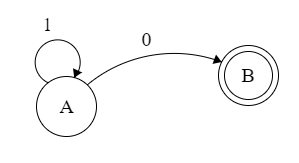

# Finite Automata

Finite automata = can be implementation of regex

They both can specify the regular languages. Simply think about it as a character by character analysis of a string. This can also be thought of/implemented as a set of nested switch statements and state variables. Implementation can be boiled down to a lookup table.

|Finite automata has..|Symbol|
|--|--|
|An input alphabet|∑|
|A set of states|S|
|A start state|n|
|A set of accepting states|F⊆S|
|A set of transitions from state to state|state →input state

**Transitions**
* Defined as: S1 →a S2
* Read as: In state S1 on input a go to state S2

**Accept/Reject**
* If we at the **end of input** and in **accepting state** => accept
* Otherwise => reject -- this means if there is no transition for the input, it fails as well
* Otherwise can be said that `S ⊈ F` // not totally sure this is the same symbol

**Finite automata diagrams**

|Name|Symbol|
|--|--|
|A state||
|The start state||
|An accepting state||
|A transition||

Okay, so, skipping the dumb ones.

Example (finite): any number of 1s, followed by a single 0

Note I forgot the start arrow, but it starts at A. Follow it in your head and you can pretty easily convince yourself that this which match the description. It also handles rejection, which you can also convince yourself of -- just have to remember that if you don't move, you reject.

This can be simplified to a table of states and transitions for each input.

|State|0 Input|1 Input|
|--|--|--|
|A|B  |A|
|B| | | |

This can be a lookup table, in a programming language, such as shown here: http://www.geeksforgeeks.org/searching-for-patterns-set-5-finite-automata/

This looks promising: http://ivanzuzak.info/noam/webapps/fsm_simulator/